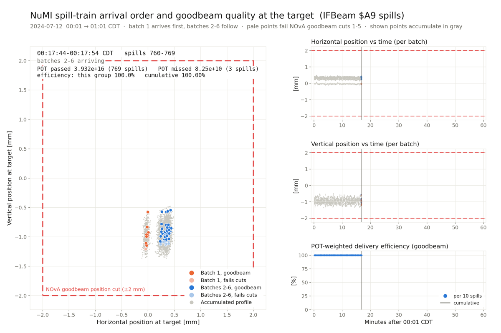

# NuMI Beam Quality for the DUNE ND 2x2 Demonstrator

Standalone tools to fetch per-spill NuMI beam data from Fermilab's
IFBeam database, evaluate NOvA-style "goodbeam" quality cuts, and
visualize the beam position at the target — including the batch-by-batch
spill-train structure and beam-delivery efficiency.



**No DUNE/2x2 software stack is required.** Everything runs from a plain
Linux environment with CERN ROOT and Python. The IFBeam REST API is
public — no Kerberos, VPN, or Fermilab credentials needed.

## Contents

| File | Purpose |
|---|---|
| `get_data.cpp` | ROOT macro: fetches all beam devices for a time window from IFBeam, writes an **uncut** `beam` TTree + tidy CSV, and a parallel `quality` TTree + CSV evaluating the NOvA goodbeam cuts per spill |
| `beam_gif.py` | Animated GIF: individual batch positions, 10 spills/frame, with the NOvA position box cut drawn |
| `beam_batches_gif.py` | Animated GIF: batch-1 vs batches-2-6 arrival order ("sloshing"), goodbeam pass/fail coloring, POT passed/missed counters, per-10-spill and cumulative delivery efficiency |
| `beam_slosh.C` | ROOT macro: animated COLZ heatmap of the batch-by-batch beam position |
| `bad_spills_report.py` | Human-readable report of every spill failing goodbeam, with derived reasons |
| `docs/` | Example bad-spill reports and a preview frame |

## Dependencies

- **CERN ROOT** (tested with 6.36) — for `get_data.cpp` and `beam_slosh.C`
- **libcurl** development headers — `sudo apt-get install libcurl4-openssl-dev`
- **nlohmann/json** — `sudo apt-get install nlohmann-json3-dev` (or place the
  single-header `nlohmann/` directory on the include path)
- **Python 3** with `numpy`, `pandas`, `matplotlib`, `Pillow` — for the GIF
  scripts and reports

## Quick start

```bash
# 1. Fetch a window (ISO-8601 times with UTC offset; -05:00 = CDT).
#    Writes get_data_<t0>_to_<t1>.root/.csv/_quality.csv into the cwd.
root -l -b -q 'get_data.cpp("2024-07-12T00:01:00-05:00","2024-07-12T01:01:00-05:00")'

# 2. Bad-spill report with reasons (writes get_data_<...>_bad_spills.txt)
python3 bad_spills_report.py get_data_2024-07-12T000100-0500_to_2024-07-12T010100-0500

# 3. Animations (3000x2000 GIFs; scripts read files from the cwd, or set BEAMQ_DIR)
python3 beam_batches_gif.py get_data_2024-07-12T000100-0500_to_2024-07-12T010100-0500
python3 beam_gif.py         get_data_2024-07-12T000100-0500_to_2024-07-12T010100-0500
root -l -b -q 'beam_slosh.C("get_data_2024-07-12T000100-0500_to_2024-07-12T010100-0500.root")'
```

With no arguments, every entry point defaults to the July 12, 2024
00:01–01:01 CDT window used during development.

## What `get_data.cpp` does

For each ACNET device below it issues one HTTPS GET to the IFBeam REST
API (`https://dbdata3vm.fnal.gov:9443/ifbeam/data/data`), restricted to
TCLK event **$A9** (the NuMI extraction event, one record per spill),
parses the JSON, and applies the unit scale factor (e.g. `"E12"` → 1e12
protons). The device names are ACNET identifiers; the data source is the
IFBeam archive of those devices — see the long header comment in
`get_data.cpp` for the full ACNET-vs-IFBeam explanation and references.

| Devices | Meaning |
|---|---|
| `E:TRTGTD`, `E:TR101D`, `E:TOR101` | POT toroids (target + upstream) |
| `E:NSLINA-D` (+ derived `E:NSLIN`) | horn stripline currents → calibrated total horn current [kA] |
| `E:HRNDIR` | horn polarity readback (value convention not publicly documented — validate before trusting) |
| `E:HPTGT[]`, `E:VPTGT[]`, `E:HP121[]`, `E:VP121[]` | BPM positions, 7-element arrays: element 0 = auto-tune average (discard), 1–6 = per-Booster-batch [mm] |
| `E:HITGT[]`, `E:VITGT[]` | BPM per-plane intensities (weights) |
| `E:MTGTDS[]` | target multiwire: 216 elements; wires 103–150 (H) and 151–198 (V) at 0.5 mm pitch |

### Outputs

- **`beam` TTree + main CSV** — every spill, deliberately uncut. One
  entry per spill on the reference timeline (device with most spills),
  other devices matched within ±0.5 s; unmatched = NaN / empty vector.
- **`quality` TTree + `_quality.csv`** — entry-aligned with `beam`
  (attach with `beam->AddFriend("quality")`). Per spill: `spillpot`,
  `hornI`, `posx`, `posy`, `widthx`, `widthy`, `is0HC`, six `pass_*`
  flags, and `goodbeam`.

## The NOvA goodbeam cuts

Values from NOvA's `IFDBSpillInfo.fcl` (`standard_ifdbspillinfo`); the
algorithms (`BpmProjection`, `BpmAtTarget`, `ProfileProjection`,
`GetGaussFit`) are ported faithfully from `IFDBSpillInfo_module.cc`
([public mirror](https://github.com/novaexperiment/novasoft/blob/main/IFDBSpillInfo/IFDBSpillInfo_module.cc)).

| # | Cut | Requirement |
|---|---|---|
| 1 | POT | `spillpot` > 2.00×10¹² (TRTGTD, TR101D fallback) |
| 2 | Horn current | −202 < I < −196.4 kA (FHC); \|I\| < 1 kA flagged `is0HC` |
| 3 | Position x | −2 < posx < +2 mm (intensity-weighted, extrapolated to target z) |
| 4 | Position y | −2 < posy < +2 mm |
| 5 | Width | 0.57 < σx, σy < 1.58 mm (multiwire Gaussian fit) |
| 6 | Timing | \|trigger − spill\| < 0.5 s — **not evaluable here** (no detector trigger stream), so `goodbeam` = cuts 1–5 |

The full catalogue, per-cut caveats, and what is applied vs. merely
illustrated live in the "Beam-quality cuts" comment block of
`get_data.cpp`.

## Known failure modes (from July 2024 data)

- **Toroid-missing spills**: the $A9 record exists but `E:TRTGTD` and
  `E:TR101D` are both absent → POT unknown, `pass_pot = 0`, everything
  else healthy. (These are the spills that look "missing from IFBeam"
  when only a POT device is queried. `E:TOR101` direct readback is
  present and could serve as a recovery estimate.)
- **Ghost spills**: POT < 10¹¹ with no usable BPM/multiwire data.
- **Not a failure**: a periodic ~6.5 s gap in the $A9 timeline once per
  ~60.5 s Main Injector supercycle — a slot not sent to NuMI, not data loss.

Physics note: the horizontal beam position shows two "lobes" — batch 1
of each spill train lands ~0.3 mm left of batches 2–6 (visible in every
animation). It is a real, highly reproducible trajectory difference,
present already at the upstream 121 BPM station; the leading hypothesis
is the extraction-kicker waveform (rise for batch 1, flat-top droop
across 2–6).

## Credits

Original `get_data.cpp` core by **Gianfranco Ingratta** (York U.,
ingratta@yorku.ca) with **Bruce Howard** (York U.). Extended
(parameterization, TTree/CSV output, NOvA quality cuts, visualizations,
documentation) by **J. L. Barrow** (UMN, jbarrow@umn.edu) with
assistance from Anthropic's Claude (Fable 5).

References: NuMI beam NIM paper
[arXiv:1507.06690](https://arxiv.org/abs/1507.06690); NOvA
`IFDBSpillInfo`; IFBeam `DataAccessSyntax` wiki (Fermilab SSO).
